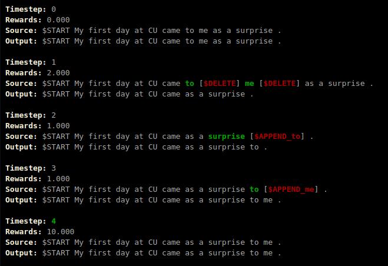

# Grammar Error Correction (GEC) using Deep Reinforcement Learning (DRL) 
In this project, we fine-tune a Sequence-to-Label model derived from [GECToR](https://github.com/grammarly/gector) using DRL.



The contributions of this project are as follows:
1. A basic RL environment for GEC task.
2. A batched-version of REINFORCE algorithm to optimize the GEC model.
3. A simple action-search algorithm to allow safe exploration during RL training.

# Setup

## Conda
The command below will setup a conda environment with required packages and submodules. 
```commandline
git clone --recurse-submodules git@github.com:RajK853/DRL-GEC.git
cd DRL-GEC
conda env create -f environment.yml
```

# Datasets
In this project, we used the following public GEC datasets:
1. [PIE Synthetic Dataset](https://github.com/awasthiabhijeet/PIE/tree/master/errorify)
2. [W\&I+LOCNESS Dataset](https://www.cl.cam.ac.uk/research/nl/bea2019st/#data)

# Data Processing

## To JSON format
The RL environment uses the datasets in the JSON format.

To process the W\&I+LOCNESS dataset from M2 format into the JSON format, use the following command:
```commandline
python m2_to_json.py --m2_path M2_PATH --json_path JSON_PATH [--min_len MIN_LEN] [--max_len MAX_LEN] [--min_sim MIN_SIM] [--only_proper_sent] [--spell_check] [--remove_ellipsis]
````
Description of the arguments are as follows:
```
--m2_path M2_PATH         # Path to the input M2 file
--json_path JSON_PATH     # Path to the output JSON files

# Optional Arguments
--min_len MIN_LEN       # Min number of tokens in original sentence
--max_len MAX_LEN       # Max number of tokens in original sentence
--min_sim MIN_SIM       # Min avg similarity between original and references
--only_proper_sent      # Allow only proper reference sentences
--spell_check           # Check spelling errors in original and references
--remove_ellipsis       # Remove (source) sentences with ellipsis
```

Use the `notebooks/PIE_to_JSON.ipynb` notebook to process the PIE Synthetic dataset into the JSON format.
This notebook adapts the `m2_to_json.py` scripts to process parallel dataset into JSON format.

> Please note that RL environment will look for a `data.json` file (`data_filtered.json` for only solvable examples) in the `data/processed/dataset_name` directory.

## To GECToR format

We use the preprocessing script from [GECToR](https://github.com/grammarly/gector) to prepare datasets
for Supervised Learning (SL) method.

> Please change the following line in the `gector/utils/preprocess_data.py` beforehand.
> Original: 
> ```python
> from helpers import write_lines, ...
> ```
> Modified: 
> ```python
> from .helpers import write_lines, ...
> ```

To convert datasets into GECToR format, use the following command:
```commandline
python json_to_gector.py --json_path JSON_PATH [--output_path OUTPUT_PATH] [--chunk_size CHUNK_SIZE]
```
Description of the arguments are as follows:
```
--json_path JSON_PATH      # Path to the input JSON file
--output_path OUTPUT_PATH  # Path to the output GECToR file

# Optional Arguments
--chunk_size CHUNK_SIZE    # Chunk size during processing
```

## Only Solvable Examples

The Sequence-to-Label model cannot correct sentences if the required label is not present in the set of labels used by the model.
Therefore, we have added a script to filter out unsolvable sentences from the JSON file using the following command:
```commandline
python filter_unsolvable.py --json_path JSON_PATH [--label_path LABEL_PATH]
```
Description of the arguments are as follows:
```
--json_path JSON_PATH      # Path to the input JSON file

# Optional Arguments
--label_path LABEL_PATH    # Path to the label vocabulary
```

This will generate a filtered JSON file with the `_filtered` suffix i.e. `data.json` -> `data_filtered.json`.

# Training
The models of our project uses the `train_sl.py` and `train_rl.py` scripts to train a model using SL and RL respectively.
These scripts take training configurations in the YAML format. Configurations we used in our project to pre-train and fine-tune the models
are present in the `configs` subdirectory. Use the following commands to pre-train and fine-tune the models using SL and RL.

```commandline
python train_sl.py configs/sl_pretrain.yaml   # SL Pre-Training
python train_sl.py configs/sl_finetune.yaml   # SL Fine-Tuning
python train_rl.py configs/rl_finetune.yaml   # RL Fine-Tuning
```

# Evaluation
In this project, we can evaluate models using following GEC benchmarks:
1. CONLL-2014
2. BEA-2019
3. JFLEG

We have separate scripts to evaluate using each benchmark. 
The `evaluate.py` script will evaluate our models on all the above benchmarks.
```commandline
python evaluate --model_dir MODEL_DIR [--label_path LABEL_PATH] [--max_iter MAX_ITER] [--force]
```
Description of the arguments are as follows:
```
--model_dir MODEL_DIR    # Path to directory with the trained models `model-best.pt` and `model-last.pt`

# Optional Arguments
--label_path LABEL_PATH  # Path to the label vocabulary
--max_iter MAX_ITER      # Max number of prediction iteration
--force                  # Override previous evaluation results
```
> To evaluate on the BEA-2019, upload the zipped model outputs to their Codalab competition [here](https://codalab.lisn.upsaclay.fr/competitions/4057). 
